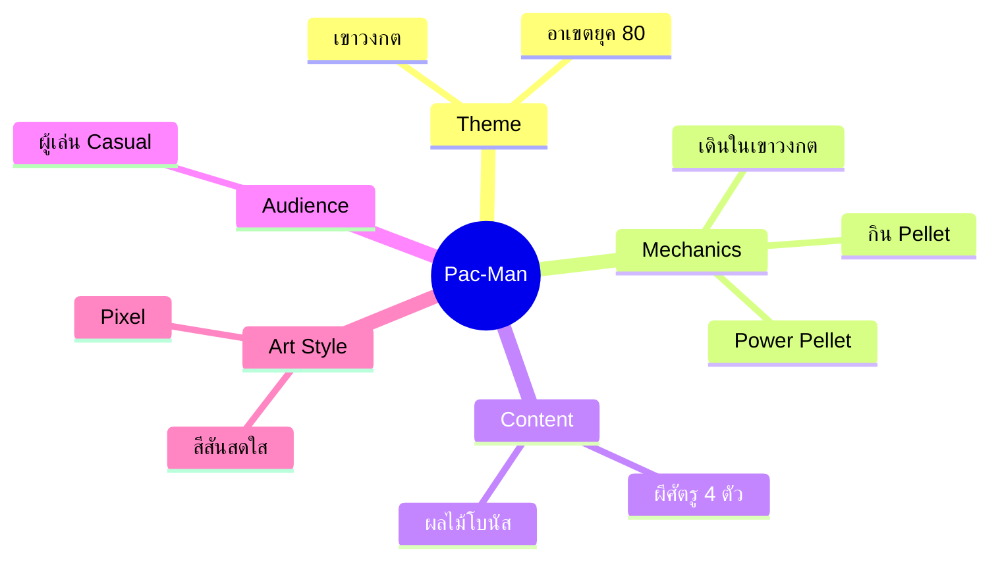
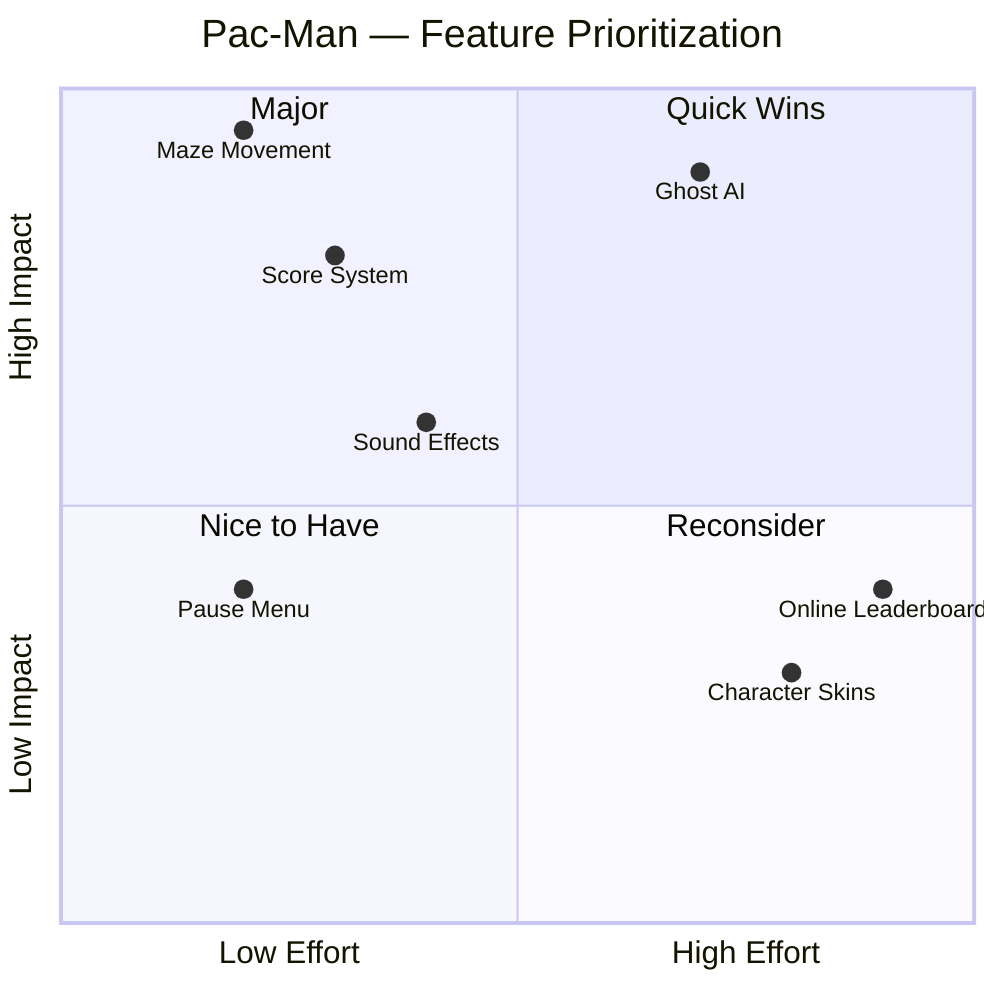
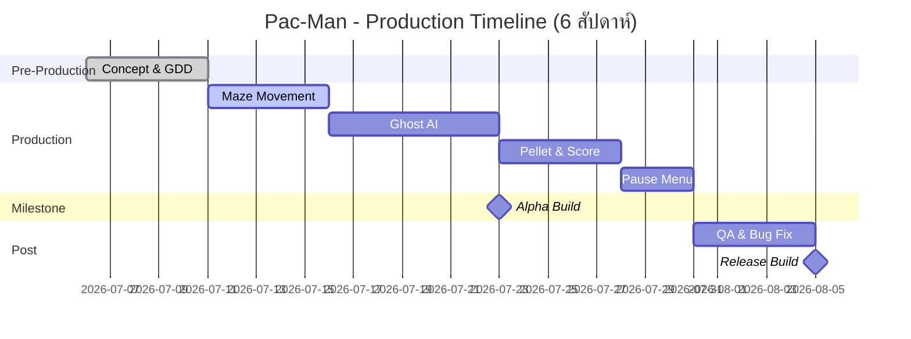

ซ้ายบน Quick Wins → ควรอยู่ใน MVP ก่อน

ขวาบน Major Projects → อาจอยู่ใน MVP ได้ถ้าจำเป็นต่อระบบหลัก แต่ส่วนใหญ่ทำต่อจาก MVP

ขวาล่าง Nice to Have → ควรตัดออกก่อนหรือเลื่อนไปทำภายหลัง

ซ้ายล่าง Reconsider → พิจารณาว่าคุ้มค่าที่จะทำหรือไม่ เพราะแม้ทำง่ายแต่ให้ประโยชน์น้อย

